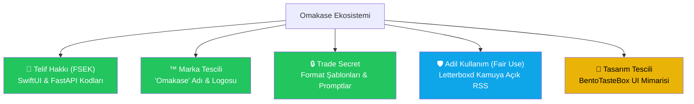

# ⚖️ Omakase — Fikri Mülkiyet, Marka & Hukuki Uyum Raporu

> **Son Güncelleme:** 11 Eylül 2026  
> **Uyarı:** Bu rapor genel bilgilendirme ve teknik-hukuki risk değerlendirmesi amacıyla hazırlanmıştır; resmi hukuki mütalaa yerine geçmez. Somut adımlardan önce bir fikri mülkiyet ve bilişim avukatına danışılması önerilir.

---

## İçindekiler

1. [Özet Değerlendirme](#1-özet-değerlendirme)
2. [Fikri Mülkiyet Koruma Türleri Haritası](#2-fikri-mülkiyet-koruma-türleri-haritası)
3. [Letterboxd & Üçüncü Taraf Platform Entegrasyonları (Önemli)](#3-letterboxd--üçüncü-taraf-platform-entegrasyonları)
4. [Prompt Mühendisliği & Ticari Sır (Trade Secret)](#4-prompt-mühendisliği--ticari-sır)
5. [Kaynak Kodu Telif Hakları (Copyright)](#5-kaynak-kodu-telif-hakları)
6. [Marka Tescili — "Omakase"](#6-marka-tescili--omakase)
7. [AI Tarafından Üretilen İçeriğin Hukuki Durumu](#7-ai-tarafından-üretilen-içeriğin-hukuki-durumu)
8. [Uluslararası Koruma & Aksiyon Planı](#8-uluslararası-koruma--aksiyon-planı)

---

## 1. Özet Değerlendirme

Omakase projesinin temel değeri üç ayaktan oluşur:
1. **İçerik Üretim Motoru:** Kullanıcının ilgi alanlarını ve kültürel günlüklerini (Letterboxd) mikro-format bilgi postlarına dönüştüren prompt mimarisi.
2. **Kullanıcı Deneyimi (UI/UX):** Instagram Reels tarzı dikey akış ile 2048 tarzı Bento keşif grid'ini birleştiren hibrit arayüz.
3. **Akıllı İletim:** Server-Sent Events (SSE) ile canlı harf harf akış ve kelime bazlı okuma bekleme süresi (reading cooldown) algoritması.

| Varlık | Koruma Türü | Durum & Uygulama |
|--------|-------------|------------------|
| **"Omakase" İsmi & Logosu** | Marka Tescili | TÜRKPATENT Sınıf 9 & Sınıf 42 başvurusu |
| **Swift & Python Kaynak Kodları** | Telif Hakkı (FSEK) | Kod yazıldığı anda otomatik doğar |
| **Prompt Mimarisi & Şablonlar** | Ticari Sır (Trade Secret) | Backend ortamında gizli tutularak korunur |
| **Bento Keşif Izgarası Tasarımı** | Tasarım Tescili | Özgün UI unsurları için opsiyonel tescil |
| **Letterboxd Entegrasyonu** | Adil Kullanım (Fair Use) | RSS tabanlı, logo taklit etmeyen telifsiz model |

---

## 2. Fikri Mülkiyet Koruma Türleri Haritası

---

## 3. Letterboxd & Üçüncü Taraf Platform Entegrasyonları

Omakase'nin en sevilen özelliklerinden biri, kullanıcının son izlediği filmleri Letterboxd günlüğünden çekerek doğrulanmış kamera arkası anekdotları üretmesidir. Bu entegrasyonun fikri mülkiyet analizi şu şekildedir:

### A. Logo Taklidi ve Marka İhlali Riskinin Giderilmesi
* **Eski Durum / Risk:** İlk prototipte Letterboxd'nin tescilli 3 renkli daire logosunu andıran yan yana 3 yuvarlak kullanılmıştı. Bu durum Letterboxd Limited şirketinin marka haklarına tecavüz (trademark dilution/infringement) riski yaratabilirdi.
* **Uygulanan Çözüm:** Taklit öğeler tamamen kaldırıldı. Yerine koyu sinematik arka plan üzerinde bağımsız, neon yeşili modern bir patlamış mısır ikonu (`popcorn.fill`) yerleştirildi.
* **Hukuki Güvence:** Arayüzde hiçbir resmi logo kopyalanmamış olup, yalnızca hizmetin kime ait olduğunu dürüstçe belirtmek üzere *"Belirtici Adil Kullanım"* (Nominative Fair Use) çerçevesinde "LETTERBOXD" kelimesi metin olarak kullanılmıştır.

### B. Kamuya Açık RSS Feed Kullanımının Hukuki Niteliği
1. **Şifresiz ve Kamuya Açık Veri:** Omakase, Letterboxd'nin özel API anahtarlarını kırmaz veya kullanıcı parolası istemez; kullanıcının zaten kamuya açık olan web RSS beslemesini (`letterboxd.com/{username}/rss/`) kullanıcının kendi talebiyle okur.
2. **Yeniden Dağıtım Yapılmaması (No Reselling):** Çekilen film adları ve izleme tarihleri hiçbir veritabanında toplanıp satılmaz veya 3. şahıslara dağıtılmaz. Yalnızca kullanıcının anlık post üretimi için Gemini modeline girdi parametresi olarak verilir.
3. **Dönüştürücü Kullanım (Transformative Use):** Omakase, Letterboxd'nin içeriğini kopyalayıp göstermez; film listesini yapay zeka ile sentezleyerek tamamen yeni ve özgün bir kamera arkası kültürel anekdotuna dönüştürür. ABD ve AB telif hukuku doktrininde dönüştürücü kullanım güçlü bir adil kullanım savunmasıdır.

---

## 4. Prompt Mühendisliği & Ticari Sır (Trade Secret)

Omakase'nin ürettiği içeriklerin kalitesi, `backend/main.py` içerisindeki prompt yönergelerine ve format şablonlarına dayanır:
- **7+ Özel Format:** `DEBATE`, `TIMELINE`, `VERSUS`, `LETTERBOXD DIARY`, `MYTHBUSTER`, `IF YOU LIKE X TRY Y`, `ANECDOTE`.
- **Halüsinasyon Önleyici Çerçeve:** "Asla sahte fun-fact uydurma, doğrulanmış prodüksiyon anekdotu yoksa yönetmenlik/sinematografi zanaatına odaklan" kuralları.

### Koruma Yöntemi
Prompt'lar patentlenemez (yazılım patenti kapsamına girmez), ancak **Ticari Sır (Trade Secret)** olarak kusursuz korunabilir:
1. Backend kodu Cloud Run üzerinde sunucu tarafında çalışır; prompt metinleri istemciye (iOS binary) asla gönderilmez.
2. Tersine mühendislikle (reverse engineering) IPA dosyası çözülse dahi promptlar ele geçirilemez.

---

## 5. Kaynak Kodu Telif Hakları

* 5846 sayılı Fikir ve Sanat Eserleri Kanunu (FSEK) uyarınca, SwiftUI ve Python kaynak kodları yazıldığı andan itibaren otomatik olarak koruma altındadır.
* İspat kolaylığı açısından kod deposunun Git commit geçmişi ve GitHub özel deposundaki zaman damgaları geçerli delil niteliği taşır.

---

## 6. Marka Tescili — "Omakase"

"Omakase", Japonca "şefe bırakmak / şefin seçimi" anlamına gelen jenerik bir mutfak terimidir. Ancak yazılım ve mobil uygulama sektöründe **fantezi/metaforik marka** statüsü kazanır.

* **Tescil Edilecek Sınıflar:**
  - **Sınıf 09:** İndirilebilir mobil uygulamalar, yapay zeka tabanlı sosyal ağ yazılımları.
  - **Sınıf 42:** SaaS hizmetleri, yapay zeka içerik üretim platformu hizmetleri.
* **Tavsiye:** Türkiye'de TÜRKPATENT nezdinde logo + "Omakase" ibaresiyle başvuru yapılması tescil şansını artırır.

---

## 7. AI Tarafından Üretilen İçeriğin Hukuki Durumu

1. **Telif Sahibi Kimdir?**
   Mevcut dünya hukukunda (ABD Telif Ofisi ve AB kararları) yapay zekanın tamamen otonom ürettiği metinlerin üzerinde insana ait bir telif hakkı doğmaz.
2. **Kullanıcı Hakları:**
   Kullanıcılar Omakase'de üretilen metinleri diledikleri sosyal mecrada serbestçe paylaşabilir; Omakase kullanıcıya bu içerikleri kopyalama ve paylaşma hakkı tanır.
3. **Hukuki Sorumluluk:**
   Kullanım Şartları (EULA) metnine *"Yapay zeka tarafından üretilen içerikler eğlence ve genel kültür amaçlıdır; içeriklerin mutlak doğruluğu garanti edilmez"* ibaresi eklenmelidir.

---

## 8. Uluslararası Koruma & Aksiyon Planı

1. **Marka Başvurusu:** TÜRKPATENT başvurusu öncelikli olarak tamamlanmalı, 6 ay içinde Madrid Protokolü ile ABD ve AB'ye genişletilmelidir.
2. **Kullanıcı Sözleşmesi (EULA) & Gizlilik Politikası:** App Store'a yüklemeden önce Letterboxd RSS kullanımının ve AI moderasyon şartlarının belirtildiği bir yasal sözleşme yayına alınmalıdır.
