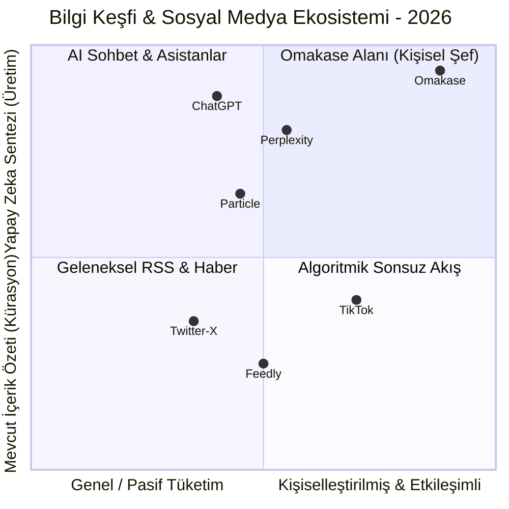

# 🔮 Omakase — Gelecek Stratejisi, Büyüme & Vizyon Raporu

> **Son Güncelleme:** 11 Eylül 2026  
> **Kapsam:** Pazar konumlandırması, rekabet analizi, kültürel veri savunma hattı (Moat), büyüme stratejisi ve uzun vadeli ürün vizyonu.

---

## İçindekiler

1. [Pazar Haritası & Konumlandırma](#1-pazar-haritası--konumlandırma)
2. [Omakase'nin Savunma Hattı (Moat Analizi)](#2-omakasenin-savunma-hattı-moat-analizi)
3. [Doyum Psikolojisi & Okuma Süresi (Doomscrolling Karşıtı Model)](#3-doyum-psikolojisi--okuma-süresi)
4. [Kültürel Entegrasyonlar Yol Haritası (Letterboxd, Spotify, Goodreads)](#4-kültürel-entegrasyonlar-yol-haritası)
5. [Kullanıcı Büyüme (Growth) & Edinme Stratejisi](#5-kullanıcı-büyüme-growth--edinme-stratejisi)
6. [Teknik Mimari & Vendor Risk Yönetimi](#6-teknik-mimari--vendor-risk-yönetimi)
7. [Uzun Vadeli Vizyon (2026 - 2028)](#7-uzun-vadeli-vizyon-2026---2028)

---

## 1. Pazar Haritası & Konumlandırma



### Özgün Değer Önerisi (Unique Value Proposition)
> **"Senin zevklerine ve kültürel alışkanlıklarına özel, anlık hazırlanan, derinlikli mikro-bilgi akışı."**

Omakase kendini bir *"AI haber özetleyici"* olarak değil, kullanıcının zihinsel damak tadını besleyen bir **"Kişisel Bilgi Şefi"** olarak konumlandırır:
* **Haber değil, zamansız merak ve kültür:** Gündemin yıpratıcı hızından uzak, sinema, bilim, felsefe, sanat ve teknoloji odaklı.
* **Algoritma tahmini değil, doğrudan irade:** Kullanıcı Bento kutusundan o an ne tüketmek istediğini seçer.

---

## 2. Omakase'nin Savunma Hattı (Moat Analizi)

Basit bir LLM wrapper'ı kolayca taklit edilebilir. Omakase'yi kopyalanamaz kılan dörtlü koruma hattı:

| Savunma Katmanı | Nasıl Çalışır? | Rakiplerin Taklit Zorluğu |
|-----------------|----------------|---------------------------|
| **1. Kültürel Veri Bağlantısı (Diary Moat)** | Kullanıcının Letterboxd'deki son 50 filmi, izleme tarihi ve puanları canlı girdi olarak kullanılır. | Kullanıcı her açtığında kendi izleme geçmişine özel post görür; bu veri Omakase dışında hiçbir sosyal mecrada yoktur. |
| **2. Bento Keşif Izgarası (BentoTasteBox)** | 2048 oyun mekaniğiyle kategori çevirme (Roll), dinamik AI alt konu türetimi ve tek dokunuşla post üretimi. | Statik text arayüzlerine kıyasla benzersiz, dokunsal ve oyunlaştırılmış bir keşif hissi sunar. |
| **3. Doyum & Cooldown Motoru** | Metin uzunluğuna göre 15-25 saniye akıllı bekleme zorunluluğu getirir. | Kullanıcıyı aptallaştıran hızlı kaydırma yerine metni gerçekten okutup sindirten bir deneyim yaratır. |
| **4. Sosyal Damak Paylaşımı** | Beğenilen şef postları Firestore üzerinden profil timeline'ına dökülür. | Topluluk oluştukça kullanıcıların kendi bilgi kürasyonları ağ etkisi yaratır. |

---

## 3. Doyum Psikolojisi & Okuma Süresi

Sosyal medya uygulamalarının en büyük problemi **"Doomscrolling" (tüketim yorgunluğu)** problemidir. Kullanıcılar postları okumadan saniyede bir kaydırır ve birkaç dakika sonra boşluk hissine kapılıp uygulamayı siler.

Omakase bu döngüyü bilinçli olarak kırar:
1. Bir post tamamlandığında kullanıcının kelime sayısına göre **okuma süresi (reading cooldown)** başlar.
2. Bu süre boyunca yeni post üretimi ve seçim butonları kilitlenir; en alttaki kartta animasyonlu bir kum saati geri sayım yapar.
3. Bu sayede kullanıcı bilgi parçasını okur, sindirir ve ancak sonrasında yeni bir posta geçer.
4. **Sonuç:** Oturum süresi kaliteli artar, token maliyeti kontrol altında tutulur ve kullanıcıda "zamanımı verimli geçirdim" hissi oluşur.

---

## 4. Kültürel Entegrasyonlar Yol Haritası

Letterboxd entegrasyonunun yakaladığı başarı, Omakase'nin diğer kültürel günlüklerle de entegre olabileceğini kanıtlamıştır:

```
┌─────────────────────────────────────────────────────────────┐
│                    Kültürel Veri Entegrasyonları            │
├───────────────────┬───────────────────┬─────────────────────┤
│ 🎬 LETTERBOXD     │ 🎵 SPOTIFY        │ 📚 GOODREADS / SBN  │
│ (Tamamlandı ✅)    │ (v2 Hedefi)       │ (v3 Hedefi)         │
│ - Son 50 film     │ - Son çalınan     │ - Son okunan kitap  │
│ - Kamera arkası   │ - Albüm yapım     │ - Felsefi analiz &  │
│   doğrulanmış     │   anektodları     │   yazarın arka plan │
│   anekdotlar      │ - Sample hikayesi │   hikayesi          │
└───────────────────┴───────────────────┴─────────────────────┘
```

---

## 5. Kullanıcı Büyüme (Growth) & Edinme Stratejisi

### A. Mikro-Viralite (Instagram & X Paylaşım Kartları)
* Omakase'de üretilen postların tipografisi ve tasarımı (Örn: *"Wong Kar-wai'nin Bitmeyen Mantı Sahnesi İşkencesi"*) doğrudan ekran görüntüsü alınıp Instagram Story veya X'te paylaşılabilecek şıklıktadır.
* Kartların altına otomatik olarak eklenen *"omakase ile demlendi"* filigranı en güçlü organik edinim motorudur.

### B. Sinema ve Kültür Toplulukları
* Letterboxd kullanıcıları sinema hakkında derinlikli trivia öğrenmeye en hevesli kitleyi oluşturur. Sinema subreddit'leri, Letterboxd Discord sunucuları ve sinema kulüpleri ilk 10.000 kullanıcı için ana odaktır.

---

## 6. Teknik Mimari & Vendor Risk Yönetimi

* **Google Cloud Run:** Sunucusuz, sıfır bakım gerektiren ve saniyede binlerce isteğe otomatik ölçeklenebilen mikroservis altyapısı.
* **Model Çeşitliliği:** Şu an Gemini 3.5 Flash kullanılmaktadır. `google-genai` SDK soyutlaması sayesinde gerektiğinde Claude 3.5 Haiku veya GPT-4o-mini yedek model olarak dakikalar içinde devreye alınabilir.

---

## 7. Uzun Vadeli Vizyon (2026 - 2028)

Omakase'nin nihai hedefi, kullanıcının tüm dijital kültürel tüketimini (izledikleri, dinledikleri, okudukları) arkada birleştiren ve her sabah ona zihnini açacak 5 dakikalık şahsi bir günlük gazete / entelektüel bento menüsü sunan vazgeçilmez bir yaşam tarzı uygulamasına dönüşmektir.
