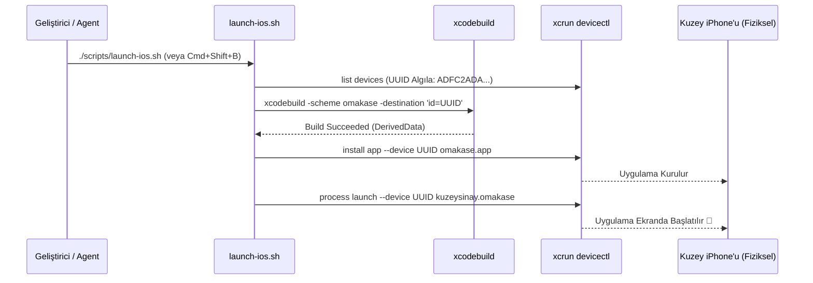

# 🔧 Omakase — Xcode, Derleme & Cihaz Konfigürasyon Raporu

> **Son Güncelleme:** 11 Eylül 2026  
> **Kapsam:** Xcode derleme ayarları, Cloud Run HTTPS endpoint konfigürasyonu, otomatik cihaz kurulum iş akışı (Sweetpad eşdeğeri), Info.plist ve App Store Release hazırlığı.

---

## İçindekiler

1. [Geliştirici Otomasyonu & Cihaz Başlatma (Sweetpad İş Akışı)](#1-geliştirici-otomasyonu--cihaz-başlatma)
2. [Info.plist & ATS (App Transport Security) Ayarları](#2-infoplist--ats-ayarları)
3. [Canlı Backend URL Yapılandırması (Cloud Run)](#3-canlı-backend-url-yapılandırması)
4. [App Store Release Build Kontrol Listesi](#4-app-store-release-build-kontrol-listesi)
5. [Xcode Derleme Mimarisi & Hata Çözüm Kılavuzu](#5-xcode-derleme-mimarisi--hata-çözüm-kılavuzu)

---

## 1. Geliştirici Otomasyonu & Cihaz Başlatma

Omakase'de kod yazıldıktan sonra geliştiriciyi Xcode GUI'sine veya manuel işlem adımlarına bağımlı kılmayan uçtan uca otomatik bir derleme ve çalıştırma altyapısı kurulmuştur:

### Otomasyon Mimarisi



### Bileşenler
1. **[`scripts/launch-ios.sh`](file:///Users/kuzey/projects/omakase/scripts/launch-ios.sh):**
   - Bağlı olan fiziksel iPhone'un UUID değerini (`ADFC2ADA-EA3F-51A7-9C82-E2554869B97D`) otomatik olarak algılar.
   - Projeyi sessiz modda derler (`-quiet`).
   - Xcode DerivedData dizininden taze `.app` paketini bulur ve `xcrun devicectl` ile telefona yükler.
   - Uygulamayı telefonda otomatik açar.
2. **[`.agents/rules/sweetpad-launch.md`](file:///Users/kuzey/projects/omakase/.agents/rules/sweetpad-launch.md) & [`GEMINI.md`](file:///Users/kuzey/projects/omakase/GEMINI.md):**
   - Yapay zeka asistanına, iOS kodunda herhangi bir değişiklik veya hata düzeltmesi yapıldığında bu betiği otomatik çalıştırma zorunluluğu getirir.
3. **[`.vscode/tasks.json`](file:///Users/kuzey/projects/omakase/.vscode/tasks.json):**
   - IDE içerisinden **`Cmd + Shift + B`** tuşlarına basıldığında bu görevi tek dokunuşla çalıştırır.

---

## 2. Info.plist & ATS (App Transport Security) Ayarları

### Mevcut Durum Analizi
Geliştirme aşamasında lokal sunucu (`http://127.0.0.1:8000`) ile çalışmak için Info.plist'e ATS istisnaları eklenmişti.

```xml
<key>NSAppTransportSecurity</key>
<dict>
    <key>NSAllowsLocalNetworking</key>
    <true/>
</dict>
```

### Prodüksiyon / App Store Geçiş Kuralı:
* **Canlı Backend:** Backend artık Google Cloud Run üzerinde geçerli bir SSL sertifikasıyla (`https://omakase-backend-20235796246.us-central1.run.app`) çalıştığı için **ATS istisnasına ihtiyaç yoktur.**
* **App Store Tavsiyesi:** Release build arşivlenmeden önce `NSAllowsLocalNetworking` veya `NSAllowsArbitraryLoads` gibi anahtarlar Info.plist'ten kaldırılmalıdır. Aksi takdirde Apple Review ekibi neden güvensiz HTTP trafiğine izin verildiğini sorgulayabilir.

---

## 3. Canlı Backend URL Yapılandırması

İstemci, API kök adresini `Info.plist` içerisindeki `OMAKASE_API_URL` anahtarından okur.

| Ortam | `OMAKASE_API_URL` Değeri | Kullanım Amacı |
|-------|--------------------------|----------------|
| **Canlı (Cloud Run)** | `https://omakase-backend-20235796246.us-central1.run.app` | Cihaz testleri, TestFlight ve Prodüksiyon |
| **Lokal (Localhost)** | `http://127.0.0.1:8000` | Simulator üzerinde lokal FastAPI testi |

> [!TIP]
> Xcode hedefi (Target) ayarlarında `OMAKASE_API_URL` değişkeni varsayılan olarak canlı Cloud Run adresine ayarlanmıştır.

---

## 4. App Store Release Build Kontrol Listesi

- [x] **Canlı HTTPS Backend:** Cloud Run entegrasyonu tamamlandı.
- [x] **Firebase Security Rules:** `firestore.rules` yapılandırıldı.
- [x] **İçerik Moderasyonu:** İstemci ve sunucu çift katmanlı küfür/zararlı içerik koruması aktif.
- [ ] **AppIcon Varlığı:** `Assets.xcassets/AppIcon.appiconset` altına 1024×1024 boyutunda PNG eklenmeli.
- [ ] **NSLocalNetworkUsageDescription Temizliği:** Eğer Release build'de lokal sunucuya istek atılmayacaksa Info.plist'teki yerel ağ izin açıklaması kaldırılmalı.
- [ ] **Sürüm Numarası:** `CFBundleShortVersionString` = `1.0.0`, `CFBundleVersion` = `1`.

---

## 5. Xcode Derleme Mimarisi & Hata Çözüm Kılavuzu

### Sembol Efektleri Uyumluluğu (iOS 17 vs iOS 18)
* `symbolEffect(.breathe)` yalnızca iOS 18+ gerektirir. Omakase'nin minimum hedefi **iOS 17.0** olduğu için okuma süresi kum saatinde evrensel uyumlu **`.symbolEffect(.pulse, isActive: true)`** tercih edilmiştir.

### Temiz Derleme (Clean Build) Komutu
Gerektiğinde derived verileri ve modül önbelleğini sıfırlamak için:
```bash
xcodebuild -scheme omakase -destination 'generic/platform=iOS' clean build -quiet
```
