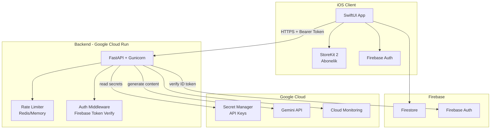
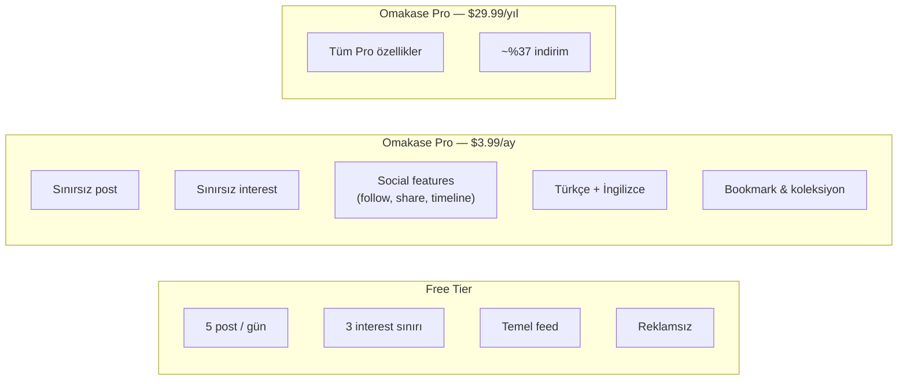

# 🍣 Omakase — App Store'a Çıkış Raporu

> **Tarih:** 9 Mayıs 2026  
> **Kapsam:** Altyapı mimarisi, API key yönetimi, maliyet analizi, abonelik stratejisi, Apple Review uyumluluğu

---

## İçindekiler

1. [Mevcut Durum Analizi](#1-mevcut-durum-analizi)
2. [Production Altyapı Mimarisi](#2-production-altyapı-mimarisi)
3. [API Key & Secret Yönetimi](#3-api-key--secret-yönetimi)
4. [Gemini API Maliyet Analizi](#4-gemini-api-maliyet-analizi)
5. [Abonelik Modeli & Monetizasyon](#5-abonelik-modeli--monetizasyon)
6. [Apple App Store Review Uyumluluğu](#6-apple-app-store-review-uyumluluğu)
7. [Güvenlik Kontrol Listesi](#7-güvenlik-kontrol-listesi)
8. [Lansman Öncesi Yapılacaklar (Checklist)](#8-lansman-öncesi-yapılacaklar)
9. [Tavsiye Edilen Yol Haritası](#9-tavsiye-edilen-yol-haritası)

---

## 1. Mevcut Durum Analizi

### Mimari Özet

```
┌──────────────┐   SSE stream   ┌──────────────┐   Gemini API
│  SwiftUI iOS │ ◄──────────── │   FastAPI     │ ◄───────────
│  (iOS 26+)   │   POST body   │  (main.py)   │
└──────┬───────┘ ──────────── ►└──────┬───────┘
       │                              │
       │  Firebase Auth               │  .env dosyası
       │  Firestore                   │  (GEMINI_API_KEY)
       ▼                              │
┌──────────────┐                      │
│   Firebase   │◄─────────────────────┘
│  (Firestore) │
└──────────────┘
```

### Mevcut Bileşenler

| Bileşen | Durum | Production Hazırlığı |
|---------|-------|---------------------|
| iOS Client (SwiftUI) | ✅ Çalışıyor | ⚠️ Hardcoded localhost URL |
| FastAPI Backend | ✅ Çalışıyor | ❌ Lokal, deploy edilmemiş |
| Firebase Auth (Google Sign-In) | ✅ Çalışıyor | ⚠️ Firestore rules eksik |
| Firestore (Social layer) | ✅ Çalışıyor | ⚠️ Security rules eksik |
| SSE Streaming | ✅ Çalışıyor | ✅ Hazır |
| Abonelik sistemi | ❌ Yok | ❌ Kurulmalı |
| Rate limiting | ❌ Yok | ❌ Kurulmalı |
| Kullanıcı auth → backend | ❌ Yok | ❌ Kurulmalı |

### Kritik Sorunlar

> [!CAUTION]
> **`.env` dosyasındaki Gemini API key'i ve `GoogleService-Info.plist` içindeki Firebase API key'i repo'da açık duruyor.** Bu key'ler sızdırılabilir. Hemen rotate edilmeli.

> [!WARNING]
> **Backend, herhangi bir authentication olmadan dışarıya açık.** Herkes `/feed/stream` ve `/interests/suggest` endpoint'lerine istek atabilir. Bu, Gemini API maliyetlerinizi kontrolsüz artırır.

> [!WARNING]
> **`AgentDebugLog` enum'u production'da kaldırılmalı.** Localhost:7607'ye debug verisi göndermeye çalışıyor.

---

## 2. Production Altyapı Mimarisi

### Hedef Mimari



### Backend Hosting: Google Cloud Run (Önerilen)

**Neden Cloud Run?**
- Gemini API zaten Google Cloud'da → aynı ekosistem, düşük latency
- Scale-to-zero: kullanılmadığında para ödemezsin
- SSE streaming destekliyor (max request timeout 60 dk'ya kadar)
- Firebase Admin SDK ile doğal entegrasyon

**Tahmini Maliyet (1000 DAU):**

| Kaynak | Birim | Aylık Tahmini |
|--------|-------|---------------|
| Cloud Run (vCPU) | ~50 saat/ay | ~$2.40 |
| Cloud Run (RAM) | 512MB instance | ~$1.35 |
| Cloud Run (Requests) | ~150K istek | Ücretsiz katmanda |
| **Toplam Cloud Run** | | **~$4-8/ay** |

**Alternatifler:**
- **Railway** ($5/ay Hobby): Hızlı deploy, basit arayüz — MVP/beta için ideal
- **Render** ($7/ay Starter): Sabit fiyat, cold start riski var

### Deployment Yapısı

```
backend/
├── main.py
├── requirements.txt
├── Dockerfile           # ← YENİ
├── .dockerignore        # ← YENİ
├── cloudbuild.yaml      # ← YENİ (CI/CD)
└── .env.example
```

**Dockerfile örneği:**
```dockerfile
FROM python:3.12-slim
WORKDIR /app
COPY requirements.txt .
RUN pip install --no-cache-dir -r requirements.txt gunicorn
COPY main.py .
CMD ["gunicorn", "main:app", "-w", "2", "-k", "uvicorn.workers.UvicornWorker", \
     "--bind", "0.0.0.0:8080", "--timeout", "120"]
```

---

## 3. API Key & Secret Yönetimi

### Mevcut Durum vs. Olması Gereken

| Şu an | Olması gereken |
|--------|---------------|
| `.env` dosyasında plaintext Gemini key | Google Cloud Secret Manager |
| `GoogleService-Info.plist` repo'da | Repo'da kalabilir (client SDK bunu gerektirir, ama Firestore rules ile korunmalı) |
| Backend'e auth yok | Firebase ID Token doğrulama |

### Adım Adım Secret Yönetimi

#### A. Backend Secrets (Gemini API Key)

```bash
# 1. Secret oluştur
gcloud secrets create gemini-api-key \
  --data-file=- <<< "AIzaSy..."

# 2. Cloud Run service account'a erişim ver
gcloud secrets add-iam-policy-binding gemini-api-key \
  --member="serviceAccount:SERVICE@PROJECT.iam.gserviceaccount.com" \
  --role="roles/secretmanager.secretAccessor"

# 3. Cloud Run deploy ederken secret'ı mount et
gcloud run deploy omakase-backend \
  --set-secrets="GEMINI_API_KEY=gemini-api-key:latest"
```

**main.py değişikliği:**
```python
# Artık .env yerine environment variable'dan gelecek (Cloud Run inject eder)
GEMINI_API_KEY = os.getenv("GEMINI_API_KEY")
```

#### B. iOS Client → Backend Authentication

Backend'e gelen her isteğe Firebase ID token eklenmelidir:

```swift
// SSEClient veya FeedViewModel'da:
let idToken = try await Auth.auth().currentUser?.getIDToken()
request.setValue("Bearer \(idToken)", forHTTPHeaderField: "Authorization")
```

Backend'de doğrulama:
```python
from firebase_admin import auth as firebase_auth, credentials, initialize_app

# Cloud Run'da Application Default Credentials ile çalışır
initialize_app()

async def verify_token(authorization: str) -> str:
    """Bearer token'dan Firebase UID döndürür."""
    token = authorization.removeprefix("Bearer ").strip()
    decoded = firebase_auth.verify_id_token(token)
    return decoded["uid"]
```

#### C. Firestore Security Rules

```javascript
rules_version = '2';
service cloud.firestore {
  match /databases/{database}/documents {
    // Kullanıcılar sadece kendi profillerini yazabilir
    match /users/{userId} {
      allow read: if request.auth != null;
      allow write: if request.auth.uid == userId;
      
      match /following/{followId} {
        allow read: if request.auth != null;
        allow write: if request.auth.uid == userId;
      }
      match /followers/{followerId} {
        allow read: if request.auth != null;
        allow write: if request.auth.uid == followerId;
      }
    }
    
    // Shared posts
    match /shared_posts/{postId} {
      allow read: if request.auth != null;
      allow create: if request.auth != null
                    && request.resource.data.authorId == request.auth.uid;
      allow delete: if resource.data.authorId == request.auth.uid;
    }
  }
}
```

---

## 4. Gemini API Maliyet Analizi

### Güncel Fiyatlar (Gemini 2.5 Flash)

| Metrik | Fiyat |
|--------|-------|
| Input tokens | $0.30 / 1M token |
| Output tokens | $2.50 / 1M token |
| Cached input | $0.03 / 1M token |

### Post Başına Maliyet Tahmini

Her `/feed/stream` çağrısında:

| Bileşen | Token Tahmini | Maliyet |
|---------|--------------|---------|
| System prompt (input) | ~350 token | $0.000105 |
| User prompt (input) | ~150 token | $0.000045 |
| Model output (post body) | ~120 token | $0.000300 |
| **Toplam / post** | ~620 token | **~$0.00045** |

Her `/interests/suggest` çağrısında:

| Bileşen | Token Tahmini | Maliyet |
|---------|--------------|---------|
| System prompt (input) | ~200 token | $0.000060 |
| User prompt (input) | ~100 token | $0.000030 |
| Model output (JSON) | ~50 token | $0.000125 |
| **Toplam / suggestion** | ~350 token | **~$0.00022** |

### Kullanıcı Senaryoları — Aylık Maliyet Projeksiyonu

| Senaryo | DAU | Post/kullanıcı/gün | Aylık Post | Gemini Maliyeti | Cloud Run | Firebase | **Toplam** |
|---------|-----|-------------------|-----------|----------------|-----------|----------|-----------|
| MVP/Beta | 100 | 5 | 15K | $6.75 | $5 | Ücretsiz | **~$12/ay** |
| Büyüme | 1,000 | 8 | 240K | $108 | $8 | $10 | **~$126/ay** |
| Olgun | 5,000 | 10 | 1.5M | $675 | $25 | $40 | **~$740/ay** |
| Ölçek | 20,000 | 10 | 6M | $2,700 | $80 | $120 | **~$2,900/ay** |

> [!IMPORTANT]
> **Ana maliyet kalemi Gemini API'dir (%80-90).** Abonelik geliri bu maliyeti karşılamalı.

### Maliyet Optimizasyon Stratejileri

1. **Context Caching:** System prompt'u cache'leyerek input maliyetini %90 düşür (~$0.03/1M vs $0.30/1M)
2. **Free tier kullanıcılara rate limit:** Günde 5 post → maliyet kontrol altında
3. **Response cache:** Aynı interest set'ine benzer postları kısa süreli cache'le (Redis, 5 dk TTL)
4. **Daha kısa output:** Prompt'ta kelime limitini 60'a düşürmek output token'ı %30 azaltır
5. **Batch generation:** Tek API call'da 3 post üret (system prompt tekrarını önler)

---

## 5. Abonelik Modeli & Monetizasyon

### Önerilen Model: Freemium + Abonelik



### Neden Bu Fiyatlandırma?

| Fiyat | Gerekçe |
|-------|---------|
| **Free: 5 post/gün** | Hook etkisi → kullanıcı ürünü tanır, alışkanlık oluşturur |
| **$3.99/ay** | Türkiye App Store'da ~₺130/ay. Kahve fiyatı psikolojisi |
| **$29.99/yıl** | Yıllık plan ile LTV artışı, churn azalması |

### Gelir Projeksiyonu

| Metrik | Değer |
|--------|-------|
| 1,000 DAU, %5 conversion | 50 abone |
| ARPU (ortalama) | $3.50/ay |
| Aylık brüt gelir | $175 |
| Apple komisyonu (%30, ilk yıl %15) | -$26 |
| Gemini + Infra maliyeti | -$126 |
| **Net kar/zarar** | **+$23/ay** |

| Metrik | Değer |
|--------|-------|
| 5,000 DAU, %7 conversion | 350 abone |
| ARPU | $3.50/ay |
| Aylık brüt gelir | $1,225 |
| Apple komisyonu (%15) | -$184 |
| Gemini + Infra maliyeti | -$740 |
| **Net kar/zarar** | **+$301/ay** |

> [!TIP]
> **Kârlılık noktası (~breakeven): ~800-1000 DAU ile %5-7 conversion oranı.** Free tier kullanıcıların post limitini sıkı tutmak maliyet kontrolünde kritik.

### StoreKit 2 Implementasyonu

**Product ID'ler:**
```
com.kuzeysinay.omakase.pro.monthly    → $3.99/ay
com.kuzeysinay.omakase.pro.yearly     → $29.99/yıl
```

**Temel Yapı:**

```swift
// SubscriptionManager.swift
import StoreKit

@Observable
final class SubscriptionManager {
    private(set) var isPro: Bool = false
    private(set) var products: [Product] = []
    private var updateTask: Task<Void, Never>?
    
    static let productIDs: Set<String> = [
        "com.kuzeysinay.omakase.pro.monthly",
        "com.kuzeysinay.omakase.pro.yearly"
    ]
    
    init() {
        updateTask = Task { await listenForUpdates() }
        Task { await checkEntitlements() }
    }
    
    func fetchProducts() async {
        products = try? await Product.products(for: Self.productIDs)
    }
    
    func purchase(_ product: Product) async throws {
        let result = try await product.purchase()
        if case .success(let verification) = result,
           case .verified(let transaction) = verification {
            await transaction.finish()
            await checkEntitlements()
        }
    }
    
    func checkEntitlements() async {
        for await result in Transaction.currentEntitlements {
            if case .verified(let transaction) = result {
                isPro = Self.productIDs.contains(transaction.productID)
                if isPro { return }
            }
        }
        isPro = false
    }
    
    private func listenForUpdates() async {
        for await result in Transaction.updates {
            if case .verified(let transaction) = result {
                await transaction.finish()
                await checkEntitlements()
            }
        }
    }
    
    func restorePurchases() async {
        try? await AppStore.sync()
        await checkEntitlements()
    }
}
```

**Backend'de abonelik kontrolü:**

Backend tarafında kullanıcının "pro" olup olmadığını Firestore'da bir `isPro` field'ı ile saklayabilir veya her istekte client'ın gönderdiği receipt'i doğrulayabilirsin. Basit yaklaşım:

1. iOS'ta satın alma başarılı → Firestore `users/{uid}.isPro = true` yaz
2. Backend her `/feed/stream` isteğinde UID'ye göre Firestore'dan kontrol et
3. Free kullanıcıya günlük 5 post limiti uygula (Redis counter veya Firestore)

---

## 6. Apple App Store Review Uyumluluğu

### Zorunlu Gereksinimler

| Gereksinim | Durum | Aksiyon |
|-----------|-------|--------|
| AI kullanımı açıklaması | ❌ | Onboarding/Settings'te "İçerikler Gemini AI ile üretilmektedir" notu ekle |
| 3. parti veri paylaşım izni | ❌ | İlk kullanımda kullanıcı interest verilerinin Google Gemini'ye gönderildiğini belirten bir consent dialog göster |
| İçerik filtreleme/moderation | ⚠️ | Gemini'nin safety settings'lerini aktif tut + report mekanizması ekle |
| Kullanıcı raporlama butonu | ❌ | Shared post'lara "Report" aksiyonu ekle |
| Kullanıcı engelleme | ❌ | Block user özelliği ekle |
| In-App Purchase (Apple IAP) | ❌ | StoreKit 2 ile implement et |
| Restore Purchases butonu | ❌ | Settings'te veya paywall'da "Satın Alımları Geri Yükle" butonu |
| Privacy Policy | ❌ | Bir URL'de host edilen privacy policy sayfası |
| Terms of Service | ❌ | Bir URL'de host edilen terms sayfası |
| App Privacy Labels | ❌ | App Store Connect'te doğru etiketler |
| Review hesap bilgileri | ❌ | Reviewer için demo Google hesabı hazırla |
| Minimum functionality | ✅ | Native SwiftUI, SSE streaming — yeterli |

### Privacy Label'da Beyan Edilecek Veriler

| Veri Türü | Kullanım | Linked to Identity? |
|-----------|----------|-------------------|
| İsim (Display Name) | App Functionality | Evet |
| Email | App Functionality | Evet |
| User Content (interests) | App Functionality | Evet |
| Identifiers (UID) | App Functionality | Evet |
| Usage Data | Analytics (opsiyonel) | Hayır |

---

## 7. Güvenlik Kontrol Listesi

### Lansmandan Önce Yapılması Gerekenler

- [ ] `.env`'deki Gemini API key'ini rotate et (eski key'i deaktive et)
- [ ] `GoogleService-Info.plist`'teki API key'i restrict et (Firebase Console → API restrictions)
- [ ] `AgentDebugLog` enum'unu ve tüm `#region agent log` bloklarını sil
- [ ] Backend'e Firebase ID token authentication ekle
- [ ] Firestore Security Rules'ları deploy et
- [ ] CORS'u `*` yerine sadece bilinen origin'lere sınırla (mobil app'te gerekli değil ama web debug için)
- [ ] Rate limiting ekle (IP başına + UID başına)
- [ ] HTTPS zorunlu kıl (Cloud Run default olarak sağlar)
- [ ] Info.plist'ten `NSAllowsLocalNetworking` ve localhost exception'ları kaldır
- [ ] `OMAKASE_API_URL`'i production URL'e güncelle

---

## 8. Lansman Öncesi Yapılacaklar

### Teknik Checklist

- [ ] Backend'i Cloud Run'a deploy et
- [ ] Custom domain al ve SSL sertifikası kur (Cloud Run otomatik)
- [ ] Gemini API key'i Secret Manager'a taşı
- [ ] Firebase Auth + backend authentication entegrasyonu
- [ ] Rate limiting implementasyonu
- [ ] StoreKit 2 abonelik sistemi
- [ ] Paywall UI tasarımı
- [ ] Free/Pro feature gating
- [ ] Xcode StoreKit Configuration file ile test
- [ ] App Store Connect Sandbox test
- [ ] Error tracking (Sentry veya Firebase Crashlytics)
- [ ] Firebase Analytics entegrasyonu

### App Store Connect Hazırlığı

- [ ] App Store screenshots (6.7", 6.1", iPad)
- [ ] App icon (1024x1024)
- [ ] App açıklaması (EN + TR)
- [ ] Keywords optimizasyonu
- [ ] Privacy Policy URL
- [ ] Terms of Service URL
- [ ] Support URL
- [ ] Marketing URL (opsiyonel)
- [ ] Demo hesap bilgileri (reviewer için)
- [ ] In-App Purchase ürünlerini App Store Connect'te oluştur
- [ ] Subscription Group oluştur

### İçerik & Legal

- [ ] KVKK / GDPR uyumlu Privacy Policy hazırla
- [ ] Kullanım Şartları hazırla
- [ ] AI kullanım açıklaması (App Store description + in-app)
- [ ] Hesap silme özelliği (Apple zorunlu kılıyor — Settings'ten)

---

## 9. Tavsiye Edilen Yol Haritası

### Faz 1 — Temizlik & Güvenlik (1-2 hafta)

1. `AgentDebugLog` ve tüm debug log bloklarını kaldır
2. API key'leri rotate et
3. Firestore Security Rules yaz ve deploy et
4. Backend'e Firebase auth middleware ekle
5. Rate limiting ekle

### Faz 2 — Production Deploy (1 hafta)

1. `Dockerfile` oluştur
2. Cloud Run'a deploy et
3. Gemini key'i Secret Manager'a taşı
4. iOS `OMAKASE_API_URL`'i production URL'e çevir
5. Smoke test

### Faz 3 — Monetizasyon (2 hafta)

1. App Store Connect'te subscription ürünlerini oluştur
2. `SubscriptionManager` implement et
3. Paywall UI tasarla ve kodla
4. Free tier limitlerini backend'e ekle (günlük 5 post)
5. StoreKit config file ile lokal test
6. Sandbox test

### Faz 4 — App Store Uyumluluğu (1 hafta)

1. AI disclosure dialog ekle
2. Report & block mekanizması ekle
3. Hesap silme özelliği ekle
4. Privacy Policy & ToS sayfaları oluştur
5. Restore Purchases butonu ekle
6. Privacy Labels'ı doldur

### Faz 5 — Lansman (1 hafta)

1. Screenshots ve promotional text hazırla
2. App Store Connect'e ilk build yükle
3. TestFlight beta dağıtımı (en az 1 hafta)
4. Review'a gönder
5. 🚀 Lansman!

---

> [!NOTE]
> **Toplam tahmini süre: 6-8 hafta** (tam zamanlı çalışma ile). En kritik öncelik güvenlik temizliği (Faz 1) ve backend deploy (Faz 2)'dir. Monetizasyon ve App Store uyumluluğu paralel yürütülebilir.
