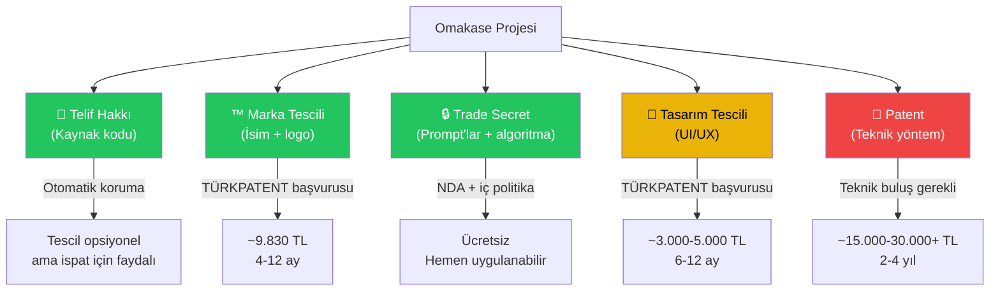

# ⚖️ Omakase — Fikri Mülkiyet & Patent Raporu

> **Uyarı:** Bu rapor genel bilgilendirme amaçlıdır ve hukuki tavsiye niteliği taşımaz. Somut adımlar atmadan önce bir **sınai mülkiyet avukatı** veya **patent vekili** ile görüşmeniz şiddetle önerilir.

---

## İçindekiler

1. [Kısa Cevap: Patent Alabilir misin?](#1-kısa-cevap)
2. [Koruma Türleri Haritası](#2-koruma-türleri-haritası)
3. [Patent — Detaylı Analiz](#3-patent)
4. [Telif Hakkı — Kaynak Kodu](#4-telif-hakkı)
5. [Marka Tescili — "Omakase"](#5-marka-tescili)
6. [AI Üretimi İçeriğin Telif Durumu](#6-ai-üretimi-içerik)
7. [Trade Secret — Prompt & Algoritma Koruması](#7-trade-secret)
8. [Tasarım Tescili — UI/UX](#8-tasarım-tescili)
9. [Uluslararası Koruma](#9-uluslararası-koruma)
10. [Maliyet Özeti & Öncelik Sıralaması](#10-maliyet-özeti)
11. [Somut Aksiyon Planı](#11-aksiyon-planı)

---

## 1. Kısa Cevap

> **"Kişiye özel anlık fun-fact üreten bir sosyal medya platformu fikrini patentleyebilir miyim? Snapchat, Instagram, Pinterest'in patenti yok mu?"**

**Kısa cevap: Platform fikrini patentleyemezsin. Snapchat, Instagram, Pinterest de fikir patenti almadı — onlar spesifik teknik yöntemleri patentledi.**

Yaygın bir yanılgı var: "Snapchat kaybolan mesaj fikrini patentledi" → **Hayır.** Snapchat, kaybolan mesajı mümkün kılan *spesifik şifreleme yöntemini, sunucu tarafı zamanlama mekanizmasını ve istemci önbellek silme tekniğini* patentledi. "Kaybolan mesaj" fikrinin kendisi hâlâ herkesin kullanabileceği bir konsept — nitekim Instagram Stories, WhatsApp Status ve onlarca başka uygulama aynı fikri farklı teknik yöntemlerle uyguladı.

Aynı mantıkla: **"Kişiye özel AI fun-fact üreten sosyal medya platformu" fikri patentlenemez.** Ama bu fikri hayata geçiren spesifik teknik çözümler *potansiyel olarak* patentlenebilir.

| Ne? | Patentlenebilir mi? | Neden? |
|-----|---------------------|--------|
| "AI ile kişiselleştirilmiş fun-fact üreten sosyal medya" **fikri/konsepti** | ❌ Hayır | Soyut fikir — hiçbir patent ofisi kabul etmez |
| "Fun-fact feed'i olan bir uygulama" **iş modeli** | ❌ Hayır | İş yöntemleri tek başına patentlenemez |
| SSE streaming + AI post üretim **teknik yöntemi** | ⚠️ Belki | "Bilgisayar tabanlı buluş" olarak değerlendirilebilir, ama yenilik kriteri zor |
| **Kaynak kodu** (Swift + Python) | ✅ Telif hakkı | Otomatik koruma, tescil gerekmez |
| **"Omakase"** ismi ve logosu | ✅ Marka tescili | TÜRKPATENT'e başvuru |
| **Prompt mühendisliği** ve format şablonları | ✅ Trade secret | Ticari sır olarak koruma |
| **UI tasarımı** | ✅ Tasarım tescili | Opsiyonel |
| AI'ın **ürettiği postlar** | ❌ Hayır | Hukuki belirsizlik — büyük olasılıkla korunamaz |

---

## 2. Koruma Türleri Haritası



---

## 3. Patent

### Snapchat, Instagram, Pinterest Neyi Patentledi?

Bu şirketler **platform fikirlerini değil, spesifik teknik implementasyonlarını** patentledi. Aradaki fark çok kritik:

| Şirket | ❌ Patentlemedikleri (Fikir) | ✅ Patentledikleri (Teknik Yöntem) |
|--------|----------------------------|-----------------------------------|
| **Snapchat** | "Kaybolan mesaj gönderme" fikri | • AR yüz filtresi için monoküler 3D mesh üretim algoritması<br>• GAN ile selfie perspektif düzeltme yöntemi<br>• Tek butonla fotoğraf/video geçişi sağlayan zamanlama mekanizması |
| **Instagram** | "Fotoğraf paylaşma sosyal ağı" fikri | • Shader tabanlı görüntü bulanıklaştırma yöntemi (mask + composite render)<br>• Sahte hesap tespit eden ML davranış analiz sistemi<br>• Feed sıralama algoritmasının spesifik sinyal ağırlıklandırma yöntemi |
| **Pinterest** | "Görsel keşif panosu" fikri | • Görsel obje grafı — farklı sahnelerdeki objeleri segmentleyip bağlayan sistem<br>• Perakende site tarama motoru (blacklist-aware virtual browser crawler)<br>• Taksonomi adayını mevcut hiyerarşiye otomatik yerleştiren neural embedding yöntemi |

> [!IMPORTANT]
> **Dikkat:** Bu şirketlerin yüzlerce, hatta binlerce patenti var — ama hiçbiri "kaybolan mesaj fikri" veya "fotoğraf paylaşma fikri" için değil. Hepsi **"bu işi TAM OLARAK NASIL yaptıklarının" teknik detayları** içindir.

### Fikir vs. İmplementasyon — Temel Ayrım

```
┌─────────────────────────────────────────────────────────┐
│                    PATENTLENEBİLİRLİK SKALI             │
│                                                         │
│  ❌ SOYUT FİKİR          ⚠️ ARA BÖLGE      ✅ TEKNİK    │
│  (Patentlenemez)         (Tartışılır)      BULUŞ       │
│                                            (Patentlenebilir)
│                                                         │
│  "AI ile kişiye özel     "LLM çıktısını    "Spesifik    │
│   bilgi üreten bir        real-time parse   hash-based  │
│   sosyal medya"           edip SSE ile      duplicate   │
│                           stream eden       detection   │
│  "Fun-fact feed'i         bir sistem"       algoritması │
│   olan uygulama"                            ile LLM     │
│                                             çıktısında  │
│  "İlgi alanlarına                           tekrar      │
│   göre içerik                               önleme      │
│   kişiselleştirme"                          yöntemi"    │
│                                                         │
└─────────────────────────────────────────────────────────┘
```

Senin "kişiye özel anlık fun-fact üreten sosyal medya" fikrin soldaki kutuda — **soyut bir konsept**. Bunu hiçbir patent ofisi (TÜRKPATENT, USPTO, EPO) kabul etmez çünkü:

1. **Fikir, buluş değildir** — Patent ancak somut, teknik, yenilikçi bir çözüme verilir
2. **İş yöntemi istisnası** — "Kullanıcıya AI ile bilgi sun" bir iş modeli, teknik çözüm değil
3. **Alice testi (ABD)** — "Bilgisayar üzerinde soyut bir fikri uygulamak" tek başına patent hakkı vermez

### Peki Omakase'de Patentlenebilecek Bir Şey Var mı?

**Potansiyel olarak patentlenebilir teknik unsurlar:**

| # | Teknik Unsur | Patentlenebilirlik | Neden? |
|---|-------------|-------------------|--------|
| 1 | SSE token drip-feed — LLM çıktısını kelime sınırlarında bölerek smooth streaming | ⚠️ Düşük-Orta | SSE ve string splitting bilinen teknikler; birleşimi "aşikâr" sayılabilir |
| 2 | Rotating format template — `seen_count` bazlı döngüsel format seçimi | ❌ Düşük | Round-robin seçim çok temel bir programlama tekniği |
| 3 | Real-time structured output parsing — Title/Tags/Body'nin stream içinde ayrıştırılması | ⚠️ Düşük-Orta | Regex-based stream parsing bilinen bir teknik |
| 4 | Interest-weighted prompt construction — Kullanıcı interest'lerine ağırlık atayarak LLM'e dinamik prompt oluşturma | ⚠️ Orta | Eğer yenilikçi bir ağırlıklandırma algoritması geliştirirsen daha güçlenir |
| 5 | AI-generated content social graph — AI içeriğinin sosyal ağda paylaşım ve keşif mekanizması | ⚠️ Orta | Bu daha özgün bir teknik problem çözebilir |

**Gerçekçi değerlendirme:**

> [!WARNING]
> Mevcut teknikler bilinen yöntemlerin (SSE, prompt engineering, string parsing) kombinasyonudur. TÜRKPATENT'in **"buluş basamağı"** kriterini aşması zor olabilir. **Ancak**, ileride geliştireceğin yenilikçi teknik çözümler (örn: kullanıcı davranış verisinden otomatik prompt optimizasyonu, AI içerik kalite scoring sistemi, cross-user interest similarity engine) patent için daha güçlü adaylar olabilir.

### Türkiye'de Yazılım Patenti — Kurallar

6769 sayılı Sınai Mülkiyet Kanunu'na (SMK) göre:

> **Bilgisayar programları (yazılımlar) tek başlarına patentlenemez.**

Ancak, yazılımın bir **"bilgisayar tabanlı buluş"** (Computer-Implemented Invention) niteliğinde olması durumunda patent koruması mümkün olabilir. Bunun için 3 koşul gerekir:

| Koşul | Omakase'de Durum | Değerlendirme |
|-------|-----------------|---------------|
| **Teknik problem çözmeli** | AI ile kişiselleştirilmiş içerik üretimi | ⚠️ "Kişiselleştirme" tek başına teknik problem sayılmayabilir |
| **Teknik donanım/sistemle entegre** | SSE streaming, client-server mimari | ⚠️ Standart web teknolojileri, özgün donanım entegrasyonu yok |
| **Teknik etki yaratmalı** | Streaming tokenizasyon, smooth drip-feed | ⚠️ Mevcut tekniklerin birleşimi, "buluş basamağı" tartışılır |

### Patent Maliyeti & Süresi

| Kalem | Tahmini Maliyet |
|-------|----------------|
| Patent vekili danışmanlığı | 5.000 - 15.000 TL |
| TÜRKPATENT başvuru harcı | 3.000 - 5.000 TL |
| Araştırma raporu ücreti | 3.000 - 5.000 TL |
| İnceleme raporu ücreti | 2.000 - 4.000 TL |
| **Toplam** | **~15.000 - 30.000+ TL** |
| **Süre** | **2 - 4 yıl** |

### Sonuç: Patent Yerine Ne Yapmalısın?

> [!IMPORTANT]
> Snapchat, Instagram, Pinterest **önce ürünü inşa etti, kullanıcı tabanı büyüttü, sonra teknik yeniliklerini patentledi.** Hiçbiri "fikir patenti" ile başlamadı. Senin de önceliğin:
> 1. **Ürünü lansmanla** (patent bekleme)
> 2. **Marka tescili al** (isim ve kimliğini koru)
> 3. **Trade secret'ları koru** (prompt'lar, algoritmalar)
> 4. **Büyüdükçe teknik yenilikler geliştir** → O zaman patent anlamlı olur

---

## 4. Telif Hakkı

### Kaynak Kodu — Otomatik Koruma

Türkiye'de yazılımlar 5846 sayılı **Fikir ve Sanat Eserleri Kanunu (FSEK)** kapsamında "ilim ve edebiyat eseri" olarak korunur.

**Kritik bilgi:** Telif hakkı, kaynak kodunun yazıldığı anda **otomatik olarak doğar**. Tescil zorunlu değildir.

| Korunan | Korunmayan |
|---------|------------|
| ✅ Kaynak kodun kendisi (Swift, Python) | ❌ Fikir, konsept, iş modeli |
| ✅ Kod yapısı ve organizasyonu | ❌ Algoritmik mantık (başka dilde yeniden yazılabilir) |
| ✅ UI metinleri, çeviriler (L10n.swift) | ❌ Fonksiyonalite (aynı işi yapan farklı kod yazılabilir) |
| ✅ Dokümantasyon, README | ❌ API endpoint yapısı |

### İspat İçin Yapılması Gerekenler

Tescil zorunlu olmasa da, bir ihtilaf durumunda "ben yazdım, bu tarihte yazdım" ispatı gerekir:

1. **Git commit geçmişi** — Zaten var ✅ En güçlü ispat aracı
2. **GitHub/GitLab'da private repo** — Tarih damgalı commit'ler
3. **Opsiyonel: FSEK isteğe bağlı kayıt** — Kültür Bakanlığı'na başvuru ile resmi kayıt
4. **Opsiyonel: Noter onayı** — Kaynak kodun çıktısını noter'e onaylatmak (güçlü ispat)

> [!TIP]
> **Git commit geçmişin (22 Nisan 2026'dan beri) zaten çok güçlü bir ispat aracı.** Ek bir işlem yapmasan bile temel koruma var. Ama projeyi public yapmadan önce tarihlerin doğruluğunu kanıtlamak için GitHub'a push etmek faydalı.

---

## 5. Marka Tescili — "Omakase"

### Bu En Önemli ve En Pratik Koruma

"Omakase" ismini ve logosunu marka olarak tescil ettirmek:
- Başka birinin aynı isimle App Store'da uygulama çıkarmasını engeller
- Marka değerini hukuki olarak korur
- Yatırımcılar için önemli bir sinyal

### "Omakase" İsmi Tescil Edilebilir mi?

| Kriter | Değerlendirme |
|--------|---------------|
| **Ayırt edicilik** | ⚠️ "Omakase" Japonca'da "şefin seçimi" demek — genel bir kelime. Ancak yazılım/teknoloji sınıfında ayırt edici olabilir |
| **Benzer marka riski** | ⚠️ Yemek/restoran sektöründe "Omakase" markaları mevcut olabilir, ama farklı sınıf (yazılım vs. restoran) |
| **Tanımlayıcılık** | ✅ Yazılım için tanımlayıcı değil — kimse "AI feed uygulaması = omakase" demez |

### Başvuru Sınıfları (Nice Sınıflandırması)

| Sınıf | Açıklama | Öncelik |
|-------|----------|---------|
| **Sınıf 9** | Bilgisayar yazılımları, mobil uygulamalar, indirilebilir yazılım | 🔴 Zorunlu |
| **Sınıf 42** | SaaS, bulut hizmetleri, yazılım tasarımı | 🟡 Önerilir |
| **Sınıf 35** | Reklam, iş yönetimi (abonelik hizmeti) | 🟢 Opsiyonel |

### Başvuru Süreci

```
1. TÜRKPATENT EPATS'a giriş (e-Devlet ile)
       │
       ▼
2. Ön araştırma — "omakase" benzer marka var mı?
       │  (TÜRKPATENT veri tabanı + WIPO Global Brand Database)
       ▼
3. Başvuru formu doldur + sınıf seç + harç öde
       │  (Tek sınıf: 2.820 TL)
       ▼
4. TÜRKPATENT şekli inceleme (1-2 ay)
       │
       ▼
5. İlan — Resmi Marka Bülteni'nde 2 ay
       │  (İtiraz süresi)
       ▼
6. Tescil harcı öde (7.010 TL) → Marka belgesi
       │
       ▼
7. Koruma süresi: 10 yıl (yenilenebilir)
```

### Maliyet

| Kalem | Tutar |
|-------|-------|
| Başvuru harcı (tek sınıf) | 2.820 TL |
| Tescil harcı | 7.010 TL |
| Ek sınıf başına | ~1.500-2.000 TL |
| Marka vekili (opsiyonel ama önerilir) | 3.000 - 8.000 TL |
| **Toplam (tek sınıf, vekil ile)** | **~13.000 - 18.000 TL** |
| **Toplam (tek sınıf, vekil olmadan)** | **~9.830 TL** |
| **Süre** | **4 - 12 ay** |

> [!IMPORTANT]
> **Marka tescili, tüm IP koruma türleri içinde en yüksek ROI'ye sahip olanıdır.** ~10.000 TL ile 10 yıl koruma alırsın. Bir başkası "Omakase" adıyla rakip uygulama çıkaramaz.

### Apple Trademark Koruması

App Store'da da marka haklarını koruyabilirsin:
- App Store Connect'te "trademark" ihlali bildirimi yapabilirsin
- Apple, tescilli marka sahiplerinin şikayetlerini ciddiye alır ve ihlal eden uygulamaları kaldırır

---

## 6. AI Üretimi İçeriğin Telif Durumu

### Omakase'nin Ürettiği Postlar Kime Ait?

Bu, 2026'nın en tartışmalı hukuki konularından biri. Omakase'de Gemini'nin ürettiği postlar:

```
Kullanıcı interest'leri → Senin prompt'un → Gemini'nin çıktısı → Post
     (kullanıcı)            (senin)           (AI)             (???)
```

### Hukuki Durum

| Yargı Alanı | Durum |
|-------------|-------|
| **Türkiye (FSEK)** | AI'ın ürettiği içerik "eser" sayılmaz çünkü "sahibinin hususiyeti" kriteri bir gerçek kişi gerektirir. İnsan müdahalesi (prompt, düzenleme) varsa o kişiye atfedilebilir — ama henüz yerleşik içtihat yok. |
| **ABD (Copyright Office)** | "Human authorship" zorunlu. Salt AI çıktısı telif alınamaz. İnsan yaratıcı kontrolü belirginse kısmi koruma mümkün. |
| **AB** | Benzer yaklaşım — insan yaratıcılığı şart. |

### Omakase İçin Pratik Sonuçlar

1. **Kullanıcıların oluşturduğu postlar üzerinde telif iddia edemezsin** — Gemini bunları üretti
2. **Kullanıcılar da telif iddia edemez** — Sadece "interest" girdiler, yaratıcı kontrol yok
3. **Postlar büyük olasılıkla kamuya aittir** (public domain)
4. **Ama senin prompt template'lerin korunabilir** — Bunlar senin yaratıcı eserin (trade secret olarak)

> [!WARNING]
> **Bir kullanıcı Omakase'den aldığı bir post'u "kendi yazdım" diye paylaşırsa hukuki müdahale şansın çok düşük.** Bu uygulamanın doğası gereği böyle — ama bu bir risk değil, bir özellik. İçeriğin paylaşılması Omakase'nin büyümesine yardımcı olur.

### Terms of Service'te Belirtilmesi Gerekenler

```
- AI tarafından üretilen içerikler üzerinde kullanıcıya münhasır 
  telif hakkı tanınmaz.
- Kullanıcılar üretilen içerikleri kişisel ve sosyal amaçlarla 
  özgürce paylaşabilir.
- Omakase, üretilen içeriklerin doğruluğunu garanti etmez.
- Omakase, platform üzerinde üretilen içerikleri hizmet 
  geliştirme amacıyla kullanma hakkını saklı tutar.
```

---

## 7. Trade Secret — Prompt & Algoritma Koruması

### En Kolay ve En Etkili Koruma

Omakase'nin gerçek "sırrı" patent başvurusuyla halka açılacak bir teknik yöntem değil, şunlar:

| Korunan Varlık | Nerede? | Kritiklik |
|----------------|---------|-----------|
| **System prompt** (`SYSTEM_PROMPT`) | `main.py:113-131` | 🔴 Çok yüksek |
| **Post format şablonları** (`_POST_FORMATS`) | `main.py:155-193` | 🔴 Çok yüksek |
| **Interest suggestion prompt** (`_SUGGEST_SYSTEM`) | `main.py:501-513` | 🟡 Yüksek |
| **Token drip-feed parametreleri** | `main.py:229-234` | 🟢 Orta |
| **Language-specific instructions** | `main.py:134-147` | 🟢 Orta |

### Nasıl Korunur?

1. **Prompt'ları backend'de tut** — Zaten öyle ✅ Client (iOS) hiçbir zaman prompt'ları görmüyor
2. **Repo'yu private tut** — GitHub'da public yapmadığın sürece kimse göremez
3. **NDA (Gizlilik Sözleşmesi)** — Projeye dahil olan her geliştirici, tasarımcı veya yatırımcı ile NDA imzala
4. **Çalışan sözleşmesi** — Ekip genişlerse, iş sözleşmelerine "ticari sır" ve "rekabet yasağı" maddeleri ekle
5. **API'yi koru** — Backend'e auth ekle (önceki raporlarda detaylandırıldı) ki kimse prompt'ları reverse-engineer edemesin

> [!TIP]
> **Trade secret koruması ücretsizdir ve süresizdir** (sır olarak kaldığı sürece). Patent'in aksine halka açıklanması gerekmez. Omakase'nin prompt mühendisliği için en uygun koruma budur.

### Risk: Reverse Engineering

Bir rakip, Omakase'nin API'sine istek atarak çıktı formatını analiz edebilir ve benzer prompt'lar yazabilir. Bunu önlemek için:
- Backend'e authentication (yapılmalı, zaten)
- Rate limiting (yapılmalı, zaten)
- Çıktıda format bilgisi ifşa etmeme (post format adlarını client'a gönderme)

---

## 8. Tasarım Tescili — UI/UX

### Opsiyonel Ama Değerli

Omakase'nin UI tasarımı (post kartları, streaming efekti, tab yapısı) tasarım tescili ile korunabilir. Bu, birebir görsel kopyalamayı engeller.

| Unsur | Tescil Edilebilir mi? |
|-------|----------------------|
| Post kart tasarımı (rounded corners, LIVE badge, tag chips) | ✅ |
| Feed akışı ve genel layout | ⚠️ Çok genel, zor |
| Onboarding ekranı tasarımı | ✅ |
| App icon | ✅ (henüz yok) |
| Streaming animasyonu (blinking cursor) | ❌ Animasyonlar tasarım tescili kapsamında değil |

**Maliyet:** ~3.000 - 5.000 TL (TÜRKPATENT)  
**Süre:** 6 - 12 ay  
**Koruma:** 5 yıl (25 yıla kadar yenilenebilir)

---

## 9. Uluslararası Koruma

### Eğer Global Pazar Hedefleniyorsa

| Koruma | Yöntem | Maliyet |
|--------|--------|---------|
| **Marka (global)** | Madrid Protokolü üzerinden uluslararası başvuru | ~3.000 - 10.000 CHF (ülke sayısına bağlı) |
| **Patent (global)** | PCT (Patent Cooperation Treaty) başvurusu | ~30.000 - 100.000+ TL (çok pahalı) |
| **Telif (global)** | Bern Sözleşmesi — Türkiye üye, otomatik karşılıklı koruma | Ücretsiz ✅ |

> [!TIP]
> **Bern Sözleşmesi sayesinde kaynak kodun 180+ ülkede otomatik olarak telif koruması altında.** Ek işlem gerekmez.

Marka için: Eğer sadece Türkiye + ABD hedefliyorsan, önce TÜRKPATENT'te tescil, sonra ABD USPTO'ya ayrı başvuru (~$250-350 per class) daha ekonomik olabilir.

---

## 10. Maliyet Özeti & Öncelik Sıralaması

| Koruma Türü | Maliyet | Süre | Etki | Öncelik |
|-------------|---------|------|------|---------|
| **Trade Secret** (NDA, repo private) | ~0 TL | Hemen | 🔴 Yüksek | 1️⃣ |
| **Telif Hakkı** (Git geçmişi, opsiyonel noter) | 0 - 2.000 TL | Otomatik | 🔴 Yüksek | 2️⃣ |
| **Marka Tescili** (TÜRKPATENT) | ~10.000 - 18.000 TL | 4-12 ay | 🔴 Çok Yüksek | 3️⃣ |
| **Tasarım Tescili** (UI/UX) | ~3.000 - 5.000 TL | 6-12 ay | 🟡 Orta | 4️⃣ |
| **Patent Başvurusu** | ~15.000 - 30.000+ TL | 2-4 yıl | 🟢 Düşük-Orta | 5️⃣ |
| **Uluslararası Marka** (Madrid) | ~30.000 - 80.000 TL | 12-18 ay | 🟡 Yüksek (büyürse) | 6️⃣ |

---

## 11. Somut Aksiyon Planı

### Hemen Yapılacaklar (0 TL, bugün)

- [ ] Repo'nun **private** olduğundan emin ol
- [ ] `.gitignore`'da `.env` olduğunu doğrula (var ✅)
- [ ] `GoogleService-Info.plist`'teki API key'leri restrict et
- [ ] Projeye katkı sağlayan herkesle **NDA** imzala
- [ ] Git commit geçmişini korumaya al (force push yapmamaya dikkat)

### 1-2 Hafta İçinde

- [ ] TÜRKPATENT veri tabanında **"Omakase"** ön araştırma yap
- [ ] WIPO Global Brand Database'de uluslararası kontrol
- [ ] Sınıf 9 (yazılım) için marka başvurusu kararı ver
- [ ] App icon tasarımını tamamla (marka başvurusuna dahil edilecek)

### App Store Lansmanı Öncesi

- [ ] **Marka tescil başvurusu** yap (en geç lansman ile eş zamanlı)
- [ ] **Terms of Service** hazırla (AI içerik sahipliği maddeleri dahil)
- [ ] **Privacy Policy** hazırla (KVKK + GDPR)
- [ ] Telif ispat dosyası oluştur (Git log export, opsiyonel noter)

### Büyüme Aşamasında

- [ ] Patent vekili ile "bilgisayar tabanlı buluş" değerlendirmesi
- [ ] Tasarım tescili (UI/UX)
- [ ] Uluslararası marka başvurusu (büyüme hedeflenen pazarlar için)

---

> [!IMPORTANT]
> **En yüksek ROI sıralaması:** Trade Secret (ücretsiz, hemen) → Marka Tescili (~10K TL, yüksek etki) → Telif ispat (ucuz, güvenlik ağı). Patent başvurusu en son ve en pahalı seçenektir — Omakase'nin mevcut teknik yapısı için gerekli olmayabilir. Asıl korunması gereken şey **prompt mühendisliği** ve **marka kimliği**dir.
