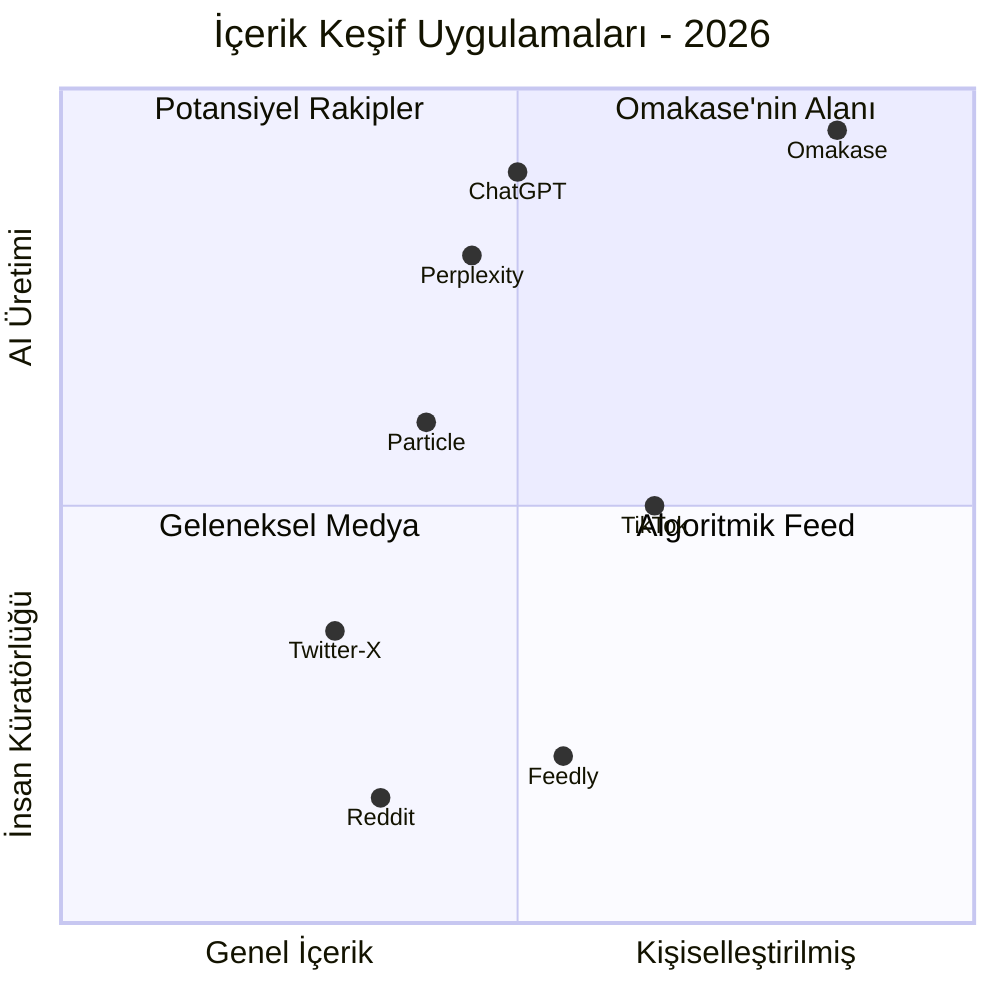
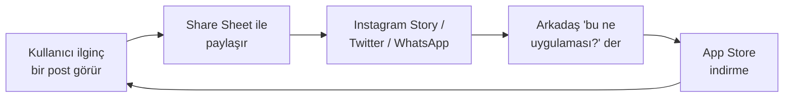
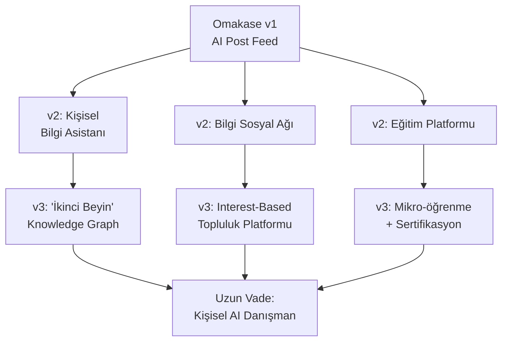

# 🔮 Omakase — Gelecek Stratejisi & Risk Analizi

> Önceki raporlarda ele alınmayan konular: rekabet analizi, büyüme stratejisi, teknik borç, vendor bağımlılığı, yasal uyumluluk, retention psikolojisi ve uzun vadeli vizyon.

---

## İçindekiler

1. [Rekabet Analizi & Pozisyonlama](#1-rekabet-analizi--pozisyonlama)
2. [Büyüme & Kullanıcı Edinme Stratejisi](#2-büyüme--kullanıcı-edinme-stratejisi)
3. [Retention Psikolojisi & Metrikler](#3-retention-psikolojisi--metrikler)
4. [Vendor Bağımlılığı & Model Risk Yönetimi](#4-vendor-bağımlılığı--model-risk-yönetimi)
5. [Teknik Borç Haritası](#5-teknik-borç-haritası)
6. [Yasal Uyumluluk — KVKK, GDPR & İçerik Sorumluluğu](#6-yasal-uyumluluk)
7. [Ölçekleme Senaryoları](#7-ölçekleme-senaryoları)
8. [Uzun Vadeli Vizyon & Pivot Potansiyeli](#8-uzun-vadeli-vizyon--pivot-potansiyeli)

---

## 1. Rekabet Analizi & Pozisyonlama

### Pazar Haritası



### Rakip Karşılaştırması

| Uygulama | Ne Yapıyor? | Omakase'den Farkı |
|----------|------------|-------------------|
| **Particle** | AI ile haber özetleme, çoklu bakış açısı | Haberlere odaklı, kullanıcı interestlerine göre üretim yok |
| **Perplexity** | Arama motoru + AI yanıt | Soru-cevap odaklı, pasif keşif yok |
| **ChatGPT** | Genel amaçlı AI chat | Feed formatı yok, "sürpriz" keşif hissi yok |
| **TikTok** | Algoritmik video feed | Video odaklı, bilgi yoğunluğu düşük |
| **Feedly** | RSS + AI özetleme | Kaynak bazlı, orijinal içerik üretmiyor |
| **Artifact** *(kapalı)* | AI haber küratörlüğü | 2024'te kapandı, Yahoo'ya satıldı |

### Omakase'nin Özgün Değer Önerisi (UVP)

> **"Senin ilgi alanlarına özel, AI tarafından üretilmiş, kısa ve şaşırtıcı bilgi parçaları — sosyal bir feed'de."**

Bu değer önerisini kimse tam olarak sunmuyor. Omakase'nin diferansiyasyonu:

1. **Üretim, küratörlük değil** — Mevcut içeriği özetlemiyor, sıfırdan üretiyor
2. **Interest-first** — Kullanıcı ne istediğini söylüyor, algoritma tahmin etmiyor
3. **Mikro-format** — 40-90 kelime, "scroll fatigue" yok
4. **Sosyal katman** — AI içeriğini paylaşma ve keşfetme

> [!TIP]
> **Positioning önerisi:** Omakase'yi "AI haber uygulaması" olarak değil, **"kişisel bilgi şefi"** olarak konumlandır. "Chef's choice" metaforu (omakase = şefin seçimi) zaten bunu destekliyor. Bu, haber uygulamalarıyla doğrudan rekabetten kaçınmanı sağlar.

### Savunma Hattı — Moat Analizi

| Moat Türü | Omakase'deki Durumu | Güçlendirme |
|-----------|-------------------|-------------|
| **Veri moat'ı** | ⚠️ Zayıf — interest listesi ve beğeniler henüz birikmedi | Kullanıcı tercihleri + feedback'i biriktir → kişiselleştirme duvarcılığı |
| **Network effect** | ⚠️ Erken — sosyal katman var ama kullanıcı yok | Topluluk büyüdükçe "takip ettiğin insanların paylaştığı bilgiler" değerli olur |
| **Marka** | ⚠️ Yok — henüz bilinmiyor | "Omakase" ismi güçlü ve akılda kalıcı, bunu erken sahiplen |
| **Switching cost** | ❌ Çok düşük — interest listesini başka yere taşımak 30 saniye | Bookmark koleksiyonları, okuma geçmişi, takip ağı → çıkış maliyetini artır |

---

## 2. Büyüme & Kullanıcı Edinme Stratejisi

### Organik Büyüme Kanalları

#### A. App Store Optimization (ASO)

**Title:** `Omakase - AI Bilgi Feed'i` (TR) / `Omakase - AI Knowledge Feed` (EN)  
**Subtitle:** `Sana özel şaşırtıcı bilgiler` (TR) / `Curated surprises for your mind` (EN)

**Keywords (100 karakter):**
```
EN: ai,fun facts,knowledge,curated,daily,learning,interests,discover,trivia,feed
TR: yapay zeka,bilgi,keşif,günlük,öğrenme,ilgi alanı,trivia,kültür,merak
```

**Kategori önerisi:**
- Primary: **Education** (daha az rekabet, daha yüksek conversion)
- Secondary: **Entertainment**

> [!IMPORTANT]
> İlk 3 screenshot **her şeyi** belirler. Kullanıcılar ortalama 3 saniyede karar veriyor. SSE streaming efektini gösteren bir video preview çok etkili olur.

#### B. İçerik Pazarlama — Viral Loop

Omakase'nin en güçlü organik büyüme kanalı **postların kendisi**:



**Bunun için gerekli:**
1. Share Sheet özelliği (güzel formatlı kart görseli)
2. Paylaşılan görselde "Omakase" watermark/branding
3. Deep link → App Store sayfasına yönlendirme

#### C. Topluluk & Niş Pazarlama

| Kanal | Taktik | Maliyet |
|-------|--------|---------|
| **Reddit** | r/InternetIsBeautiful, r/todayilearned'de organik paylaşım | $0 |
| **Product Hunt** | Launch day kampanyası | $0 |
| **Twitter/X** | Günlük "fun fact" paylaşımı, app'ten alıntıyla | $0 |
| **Mikro-influencer** | Niş YouTube/TikTok kanallarıyla işbirliği (1K-50K takipçi) | $50-200/kişi |
| **Üniversite** | YTÜ ve diğer kampüslerde "yapay zeka kullanan öğrenci projesi" PR'ı | $0 |

#### D. Referral Programı (v2)

"Bir arkadaşını davet et, ikiniz de 1 hafta Pro" → ücretsiz, güçlü büyüme mekanizması.

---

## 3. Retention Psikolojisi & Metrikler

### Endüstri Benchmarkları (AI Uygulamaları, 2026)

| Metrik | Ortalama | İyi | Mükemmel |
|--------|---------|-----|----------|
| Day 1 Retention | %25-30 | %35 | %45+ |
| Day 7 Retention | %10-15 | %20 | %30+ |
| Day 30 Retention | %5-7 | %10 | %15+ |
| Yıllık Retention (AI) | %21 | %30 | %40+ |
| DAU/MAU (Stickiness) | %15-20 | %25 | %35+ |

> [!WARNING]
> **AI uygulamalarında kullanıcılar abonelikleri geleneksel uygulamalara göre ~%30 daha hızlı iptal ediyor.** "Wow" etkisi hızla geçiyor. Bunu önlemenin yolu: rutin oluşturmak.

### Omakase İçin Habit Loop Tasarımı

```
┌─────────────────────────────────────────────────┐
│              THE OMAKASE HABIT LOOP              │
│                                                  │
│   🔔 TRIGGER          → Push: "Günün menüsü     │
│   (Tetik)                hazır 🍣"               │
│                                                  │
│   🎬 ACTION           → Uygulamayı aç,          │
│   (Eylem)                postları oku             │
│                                                  │
│   🎁 VARIABLE REWARD  → "Bunu bilmiyordum!"     │
│   (Değişken Ödül)        sürprizi                │
│                                                  │
│   💰 INVESTMENT       → Bookmark, share,         │
│   (Yatırım)              👍/👎 feedback           │
│                                                  │
└─────────────────────────────────────────────────┘
```

**Kritik:** "Variable reward" (değişken ödül) en önemli parça. Her post farklı format + konu olmalı → slot makinesi etkisi. Mevcut 7 format template'in bunu zaten destekliyor ama çeşitlilik artırılmalı.

### İzlenmesi Gereken KPI'lar

| KPI | Nasıl Ölçülecek? | Hedef |
|-----|------------------|-------|
| **İlk session değer süresi** | Onboarding → ilk post'u okuma süresi | < 90 saniye |
| **Post/session** | Ortalama kaç post okunuyor per session | 4+ |
| **Bookmark oranı** | Bookmark edilen post / toplam üretilen post | %15+ |
| **Share oranı** | Paylaşılan post / toplam okunan post | %5+ |
| **7-gün geri dönüş** | Day 7 retention | %20+ |
| **Free → Pro conversion** | Trial start / total free users | %5-8 |

---

## 4. Vendor Bağımlılığı & Model Risk Yönetimi

### Mevcut Risk: %100 Gemini Bağımlılığı

Omakase şu an Gemini 2.5 Flash'a tam bağımlı. Olası senaryolar:

| Risk | Olasılık | Etki | Sonuç |
|------|---------|------|-------|
| Gemini API fiyat artışı | Yüksek | Kritik | Kârlılık sıfırlanır |
| API kesintisi / downtime | Orta | Yüksek | Uygulama tamamen çalışmaz |
| Model kalite değişimi | Orta | Orta | Post kalitesi düşer |
| Google API'yi kaldırır | Düşük | Kritik | Uygulama ölür |
| Rate limit/kota sıkılaştırma | Orta | Yüksek | Yoğun saatlerde hizmet verilemez |

### Çözüm: Abstraction Layer

Backend'de model çağrısını bir abstraction katmanı arkasına al:

```python
# providers/base.py
class LLMProvider(ABC):
    @abstractmethod
    async def generate_stream(self, system: str, user: str) -> AsyncIterator[str]: ...

# providers/gemini.py
class GeminiProvider(LLMProvider):
    async def generate_stream(self, system, user):
        model = genai.GenerativeModel(model_name=self.model, system_instruction=system)
        response = model.generate_content(user, stream=True)
        for chunk in response:
            yield chunk.text

# providers/openai.py  (yedek)
class OpenAIProvider(LLMProvider):
    async def generate_stream(self, system, user):
        response = await openai.chat.completions.create(
            model="gpt-4o-mini", messages=[...], stream=True
        )
        async for chunk in response:
            yield chunk.choices[0].delta.content

# Fallback zinciri
provider = GeminiProvider()  # primary
fallback = OpenAIProvider()  # secondary
```

**Fayda:**
- Gemini çökerse otomatik OpenAI/Claude'a geç
- A/B test: hangi model daha iyi post üretiyor?
- Maliyet optimizasyonu: ucuz model'i düşük trafikte, pahalıyı yoğun saatlerde kullan

### Alternatif Model Maliyetleri Karşılaştırması

| Model | Input $/1M | Output $/1M | Post başı | Not |
|-------|-----------|------------|-----------|-----|
| **Gemini 2.5 Flash** | $0.30 | $2.50 | ~$0.00045 | Mevcut, en ucuz |
| GPT-4o Mini | $0.15 | $0.60 | ~$0.00015 | Çok ucuz ama kalite? |
| Claude 3.5 Haiku | $0.25 | $1.25 | ~$0.00025 | İyi denge |
| GPT-4o | $2.50 | $10.00 | ~$0.0017 | Pahalı, premium tier için |
| Gemini 2.5 Pro | $1.25 | $10.00 | ~$0.0017 | Premium tier için |

> [!TIP]
> **Strateji:** Free kullanıcılara GPT-4o Mini veya Gemini Flash (en ucuz), Pro kullanıcılara Gemini Pro veya GPT-4o (en kaliteli). Model seçimi bir feature olur.

---

## 5. Teknik Borç Haritası

Mevcut koddaki ölçekleme öncesi düzeltilmesi gereken yapısal sorunlar:

### A. Veri Kalıcılığı — UserDefaults Sınırları

| Bileşen | Şu An | Sorun | Çözüm |
|---------|-------|-------|-------|
| **Bookmarks** | `UserDefaults` (JSON blob) | 100+ bookmark'ta yavaşlar, sync yok | SwiftData veya Core Data |
| **Interests** | `@AppStorage` (comma-separated string) | Parsing kırılgan, metadata yok | Structured model + SwiftData |
| **Feed history** | Bellekte (RAM) | App kapanınca kaybolur | Local persistence |

`BookmarkStore`'un `UserDefaults`'a JSON blob yazması 50-100 girişe kadar çalışır, ama:
- iCloud sync yok (yeni cihazda bookmark'lar kaybolur)
- Arama yapılamaz
- Migration zor

### B. Backend — Tek Dosya Monoliti

[main.py](file:///Users/kuzey/projects/omakase/backend/main.py) 615 satır ve büyüyor. Refactor önerisi:

```
backend/
├── app/
│   ├── __init__.py
│   ├── main.py              # FastAPI app + middleware
│   ├── config.py             # Settings, env vars
│   ├── auth.py               # Firebase token verification
│   ├── models.py             # Pydantic models
│   ├── prompts.py            # System prompts, formats
│   ├── providers/
│   │   ├── base.py           # LLMProvider ABC
│   │   ├── gemini.py
│   │   └── openai.py
│   ├── routers/
│   │   ├── feed.py           # /feed/stream
│   │   ├── interests.py      # /interests/suggest
│   │   └── health.py         # /health
│   └── middleware/
│       ├── rate_limit.py
│       └── usage_tracking.py
├── Dockerfile
├── requirements.txt
└── tests/
    └── test_prompts.py
```

### C. iOS — Eksik Error Boundary

`FeedView`'daki share aksiyonu hataları yutuyor:
```swift
// FeedView.swift:425 — catch bloğu boş!
} catch { }
```

Production'da bu sessiz hatalar kullanıcı deneyimini bozar. Her catch bloğu en azından log'lamalı veya kullanıcıya feedback vermeli.

### D. Gereksiz Debug Altyapısı

`AgentDebugLog` ve tüm `#region agent log` blokları silinmeli. Bunlar ~80 satır gereksiz kod ve localhost'a network çağrıları yapıyor.

---

## 6. Yasal Uyumluluk

### KVKK (Türkiye) Gereklilikleri

Omakase Türk kullanıcılara hizmet veriyorsa KVKK'ya tabi:

| Gereksinim | Durum | Aksiyon |
|-----------|-------|--------|
| **Aydınlatma metni** | ❌ | Hangi verilerin, neden, nasıl işlendiğini açıklayan metin |
| **Açık rıza** | ❌ | Interest verilerinin Gemini API'ye gönderilmesi için rıza |
| **Veri sorumlusu kaydı** | ❌ | VERBİS'e kayıt (yıllık gelire bağlı istisna olabilir) |
| **Veri silme hakkı** | ❌ | Hesap silme + tüm verileri temizleme |
| **Veri taşınabilirliği** | ❌ | Kullanıcının verilerini indirmesine izin verme |

### GDPR (AB'den erişim olursa)

- **Lawful basis:** Legitimate interest veya consent
- **Data Processing Agreement:** Google (Gemini), Firebase ile DPA
- **Cookie/tracking disclosure:** Firebase Analytics kullanılıyorsa

### İçerik Sorumluluğu

> [!WARNING]
> AI-üretimi içerik **yanlış bilgi** içerebilir. "Omakase bu bilgilerin doğruluğunu garanti etmez" disclaimer'ı şart. Özellikle sağlık, finans, hukuk konularında AI'ın ürettiği bilgiler zararlı olabilir.

**Yapılması gerekenler:**
1. Terms of Service'te AI disclaimer
2. Post'ların altında küçük "AI tarafından üretilmiştir" notu
3. Gemini'nin safety settings'lerini `BLOCK_MEDIUM_AND_ABOVE` olarak ayarla
4. Hassas konularda (sağlık, yatırım tavsiyesi vb.) extra filtreleme

---

## 7. Ölçekleme Senaryoları

### Senaryo A: Niş Başarı (Gerçekçi)

```
Timeline:  6 ay → 2,000-5,000 DAU
Gelir:     $300-600/ay net
Ekip:      Solo developer (sen)
Strateji:  Organik büyüme, üniversite ağı, Product Hunt
```

Bu senaryoda Omakase kârlı bir side project olarak sürer. Cloud Run + Gemini Flash maliyetleri karşılanır. Büyüme yavaş ama sürdürülebilir.

### Senaryo B: Viral Büyüme (İyimser)

```
Timeline:  12 ay → 20,000-50,000 DAU
Gelir:     $3,000-8,000/ay net
Ekip:      Sen + 1 backend developer
Strateji:  Bir TikTok/Twitter viral moment + influencer
Risk:      Gemini maliyetleri hızla artar, rate limiting kritik
```

Bu senaryoda multi-model strategy ve agresif caching şart. Apple'ın "Small Business Program"ından (%15 komisyon) faydalanırsın.

### Senaryo C: Platform Dönüşümü (Vizyon)

```
Timeline:  24+ ay → 100,000+ DAU
Gelir:     $20,000+/ay
Ekip:      5-8 kişi
Strateji:  AI-native "bilgi sosyal ağı" olarak konumlanma
Gerekli:   Yatırım, çoklu model, self-hosted inference
```

Bu noktada açık kaynak modellere geçiş (fine-tuned Llama, Mistral) maliyetleri %80 düşürür ama DevOps karmaşıklığı artar.

---

## 8. Uzun Vadeli Vizyon & Pivot Potansiyeli

### Omakase Nereye Evrilebilir?



### Pivot Fırsatları

| Pivot | Açıklama | Risk | Potansiyel |
|-------|----------|------|-----------|
| **B2B / Kurumsal** | Şirketlerin çalışanlarına sektörel bilgi feed'i | Düşük | Yüksek — SaaS modeli, yüksek ARPU |
| **Eğitim** | Üniversite dersleri için konu bazlı mikro-öğrenme | Orta | Orta — öğrenci WTP düşük |
| **Newsletter killer** | Substack/Revue alternatifi — AI-powered kişisel newsletter | Düşük | Yüksek — büyük pazar |
| **API ürünü** | Omakase'nin bilgi üretim motorunu API olarak sat | Orta | Orta — teknik müşteri kitlesi |

### En Güçlü Uzun Vadeli Senaryo

**"Bilgi sosyal ağı"** — Instagram fotoğraf paylaşımı için neyse, Omakase bilgi paylaşımı için o olabilir:

1. Kullanıcılar AI'ın ürettiği postları kendi "kanallarında" yayınlar
2. Diğer kullanıcılar bu kanalları takip eder
3. Interest overlap'e göre topluluklar oluşur
4. "Trending facts" keşif sayfası
5. Kullanıcılar kendi prompt'larını/formatlarını oluşturur (UGC)

Bu vizyonda Omakase'nin moat'ı kullanıcı ağı ve biriken veri olur — artık sadece bir AI wrapper değil, bir platform.

---

## Sonuç: Stratejik Öncelik Matrisi

```
                    YÜKSEK ETKİ
                        │
     ┌──────────────────┼──────────────────┐
     │                  │                  │
     │  Share Sheet     │  Multi-model     │
     │  ASO optimize    │  abstraction     │
     │  Push notif.     │  Bookmark→       │
     │  Viral loop      │  SwiftData       │
     │                  │  Backend refactor│
     │                  │                  │
DÜŞÜK├──────────────────┼──────────────────┤ YÜKSEK
EFOR │                  │                  │ EFOR
     │                  │                  │
     │  Privacy Policy  │  B2B pivot       │
     │  AI disclaimer   │  Self-hosted     │
     │  KVKK metni      │  inference       │
     │  Error logging   │  iCloud sync     │
     │                  │                  │
     └──────────────────┼──────────────────┘
                        │
                    DÜŞÜK ETKİ
```

> [!IMPORTANT]
> **Sol üst kadran (yüksek etki, düşük efor) en önce yapılmalı:** Share Sheet, ASO optimizasyonu, push notification ve viral loop. Bunlar en az çabayla en çok büyüme getirir.

> **Sağ üst kadran (yüksek etki, yüksek efor) planlanmalı:** Multi-model abstraction, SwiftData migration ve backend refactor. Bunlar ölçekleme için şart ama acil değil.

> **Sol alt kadran (düşük etki, düşük efor) hemen bitirilmeli:** Privacy policy, KVKK metni, AI disclaimer gibi yasal gereklilikler. Zaten az iş, erteleme sebebi yok.
